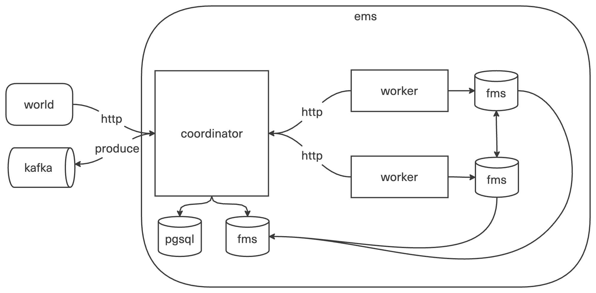

# Exec Management System (ems)

Используется для тестирования задачи, как песочница для запуска команд.

## Архитектура

## Сущности

### Команда

- Команда представляет собой атомарную, неделимую единицу, используемую для тестирования задачи.
- Команды, используемые для тестирования задачи:
    - Компиляция C++ кода.
    - Запуск скомпилированного C++ кода.
    - Запуск Python кода.
    - Запуск C++ чекера с использованием testlib (де-факто стандарт).

### Исходные данные команды

- Исходные данные команды - набор файлов, необходимых для команды.
- В качестве исходных данных команды могут использоваться
    - Заранее предопределённые файлы (например, testlib.h).
    - Файлы из пакета задачи.
    - Выходные данные другой команды.

## Процессы

### Исполнение списка команд

Список команд называется Execution.

- За полное и гарантированное исполнение Execution отвечает компонент Coordinator.
- За исполнение одной команды отвечает компонент Worker.
- Coordinator имеет планировщик, отвечающий за распределённый и параллельный запуск команд.
- Coordinator и набор Worker'ов называется Cluster.
- Execution исполняется полностью в пределах одного Cluster.
- При увеличении количества Execution'ов увеличивается количество Cluster'ов.
- Для ускорения исполнения Execution увеличивается количество Worker'ов.

### Исполнение команды

- Coordinator даёт Worker'у задачу на исполнение команды.
- Команда исполняется в изолированном контуре.
- Исполнение команды ограничивается по времени и по памяти.
- Исполнение команды ограничивается по допустимым системным вызовам.
- Исполнение команды не зависит от фактора параллельного исполнения другой команды.
    - В том числе параллельное исполнение команд не влияет на контроль времени и памяти.
