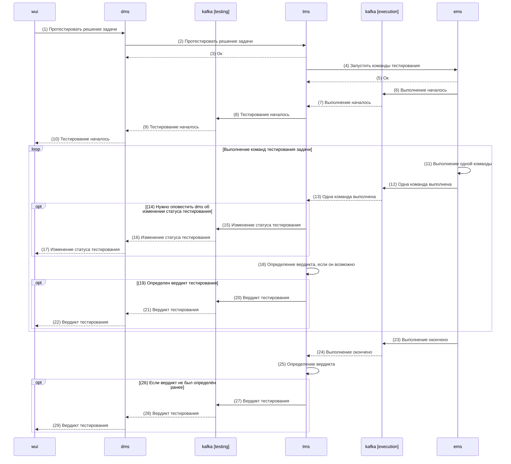
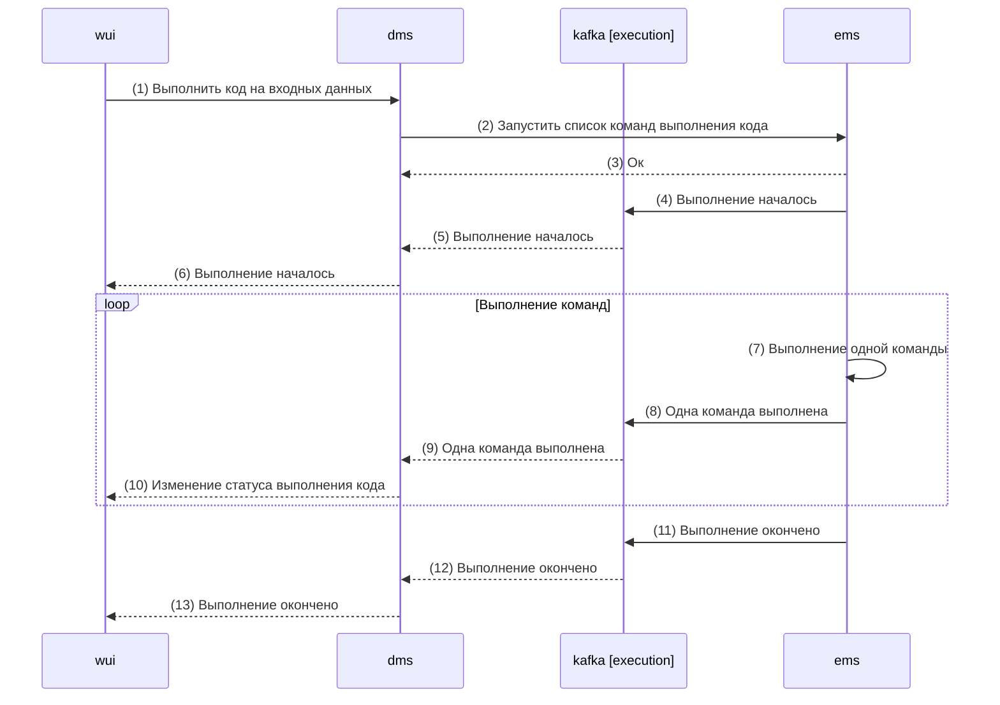

# Техническая реализация

## Архитектура

## Компоненты

1. [Web User Interface (wui)](components/wui.md)
2. [Duel Management System (dms)](components/dms.md)
3. [Task Management System (fms)](components/tms.md)
4. [Exec Management System (ems)](components/ems.md)
5. [File Management System (fms)](components/fms.md)

## Third-party компоненты

1. [Nginx](https://nginx.org)
2. [PostgreSQL](https://www.postgresql.org)
3. [Kafka](https://kafka.apache.org)

## Процессы

### Тестирование решения задачи

- `wui` имеет web-socket соединение с `dms` через nginx и отправляет сообщение с запросом на тестирование решения задачи (1), а далее ожидает сообщения с изменением статуса тестирования в web-socket соединение
- `dms` делает http запрос в `tms` на тестирование решения задачи (2) и при успешном ответе (3) далее ожидает сообщения с изменением статуса тестирования в `kafka` из топика `testing`
- `tms` делает http запрос в `ems` на запуск команд тестирования решения задачи (4) и при успешном ответе (5) далее ожидает сообщения с результатами выполнения команд в `kafka` из топика `execution`
- `ems` при запуске команд отправляет сообщение о начале выполнения команд в `kafka` в топик `execution` (6)
- `tms` при получении сообщения о начале выполнения команд (7) отправляет сообщение о начале тестирования в `kafka` в топик `testing` (8)
- `dms` при получении сообщения о начале тестирования (9) отправляет сообщение о начале тестирования в web-socket соединение с `wui` (10)
- `ems` при выполнении каждой команды (11) отправляет событие о выполнении команды в `kafka` в топик `execution` (12)
- `tms` при получении сообщения о выполнении команды (13) отправляет сообщение об изменении статуса тестирования в `kafka` в топик `testing` (15), если нужно оповестить `dms` об этом (14)
- `dms` при получении сообщения об изменении статуса тестирования отправляет сообщение об изменении статуса тестирования в web-socket соединение с `wui` (16)
- `tms` после получения каждого сообщения о выполнении команд (13) определяет вердикт тестирования (18), если его можно определить (19), и отправляет его в `kafka` в топик `testing` (20)
- `ems` при окончании выполнения команд отправляет сообщение о завершении выполнения команд в `kafka` в топик `execution` (23)
- `tms` при получении сообщения об окончании выполнения команд (24) определяет вердикт тестирования (25), если он не был определен ранее (26), и отправляет его в `kafka` в топик `testing` (27)
- `dms` при получении сообщения с вердиктом (21, 28) тестирования отправляет его в web-socket соединение с `wui` (22, 29)

### Выполнить код на входных данных

- `wui` имеет web-socket соединение с `dms` через nginx и отправляет сообщение с запросом на тестирование решения задачи (1), а далее ожидает сообщения с изменением статуса тестирования в web-socket соединение
- `dms` отправляет http запрос в `ems` на запуск команд выполнения кода (2) и при успешном ответе (3) далее ожидает сообщения с результатами выполнения команд в `kafka` из топика `execution`
- `ems` при запуске команд отправляет сообщение о начале выполнения команд в `kafka` в топик `execution` (4)
- `dms` при получении сообщения о начале выполнения команд (5) отправляет сообщение о начале тестирования в web-socket соединение с `wui` (6)
- `ems` при выполнении каждой команды (7) отправляет событие о выполнении команды в `kafka` в топик `execution` (8)
- `dms` при получении сообщения о выполнении команды (9) отправляет сообщение об изменении статуса выполнения кода в web-socket соединение с `wui` (10)
- `ems` при окончании выполнения команд отправляет сообщение о завершении выполнения команд в `kafka` в топик `execution` (11)
- `dms` при получении сообщения об окончании выполнения команд (12) отправляет в web-socket соединение с `wui` сообщение об окончании выполнения кода (13)

